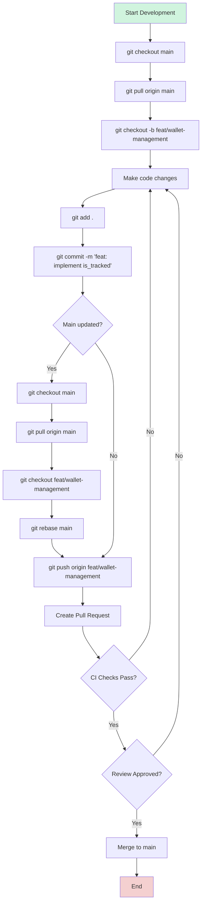

## What's Industry Standard Code?
Picture this: You're diving into a new codebase at work, and it's... beautiful. The codebase is well-structured, the
naming conventions are consistent, and the comments are clear. You're like, "Wow, this codebase is a masterpiece!" It reads
like poetry, everything makes sense, and you actually understand what your colleague was thinking when he wrote it six months
ago. That's not magic -- that's industry-standard code.

When you want to add a new feature or fix a bug, you don't have to spend hours trying to figure out where to do it or how
to write it -- the modules are explanatory, there's already a scalable interface that supports new methods. As if your
colleague was predicting the future.

But it wasn't always this way. Trust me, I've seen codebases that would make you wake up screaming in the middle of the
night, regretting why you accepted to "inherit" the codebase.

I'm going to be real with you: writing industry-standard code isn't about being a perfectionist or following conventional rules
on how to Google writes code. It's about survival. Your code isn't just yours anymore:

- That "quick fix" you wrote at 3 AM? Someone else will need to understand it during a production emergency.
- That "obvious" logic you didn't document? Your future self will stare at it in confusion six months later.
- Those "temporary" workarounds? They'll probably outlive your tenure at the company.

### Today's Challenge: It's Not Just About Writing Code Anymore
The landscape has changed dramatically. Modern development isn't just about making things work -– it's about making things work at 
scale, in teams, across time zones. We're facing challenges our coding ancestors never dreamed of:

- Microservices architectures mean your code needs to play nice with others
- Cloud deployments require your code to be resilient and observable
- Continuous deployment means your code needs to be reliable from the get-go
- Global teams mean your code needs to be understandable across cultural and linguistic barriers


Writing industry-standard code isn't about following a rigid set of rules -– it's about making life easier for everyone involved in the project, including your future self.


### My Story

I have experience writing Golang and Rust mostly, but I landed a Python-heavy role recently. The take-home assignment is
available [here](https://github.com/theghostmac/stride-airdrop-infra), and this is the review I got that made me believe I
would be accepted:



As a staff, I have been writing code in ways I never thought of. I was already accustomed to some of these practices,
but there were others:

* Write code in a collaborative manner, because you're a team member.
* Write comments for complex logic, not just for functions.
* Write comprehensive unit tests for both predictable and unpredictable scenarios.
* Add proper types to both the main logic and tests -- even Python and JS/TS now support type hinting!
* Add type hinting to code, especially if your code gets imported (like a library or module).
* Always format, lint, and sort imports in main logic AND tests codes before raising PRs.


These practices take time to implement properly. The initial setup and maintenance can be challenging, 
but the long-term benefits to code quality and team productivity are worth it.


In essence, when someone is importing your code, they should see

The bad news? They are hard to implement and usually consume a lot of time and effort.

The good news? Once you understand why these standards exist and start implementing them,
your code will be cleaner, your teams will be happier, and your projects will be more successful.

In the next sections, we'll dive into exactly how to achieve this. No theoretical fluff – just practical, 
battle-tested practices that will make you a better developer and your team more effective.

## Key Components of Industry-Standard Code

Amongst others, here are some key components of industry-standard code that I have observed and practiced:

1. Code Collaboration
2. Documentation
3. Testing
4. Type Safety
5. Code Formatting

Let's dive deeper into each of these components, with examples in different programming languages.

## Part 1: Collaborative Coding

Let's talk about how code collaboration actually works in a distributed team. While your tech interviews might focus on algorithms and data structures, most of your job will involve working with other people's code and making your code work with theirs.

### Version Control Best Practices

#### Git Workflow

In most companies, the main branch (usually `main` or `master`) is protected. This means:

- No one pushes directly to main
- All changes need a Pull Request (PR)
- PRs require at least one approval
- All checks must pass before merging

A typical workflow looks like this:



#### Branch Naming Conventions

Most teams follow a pattern like this:
```markdown
feat/   - New features
fix/    - Bug fixes
chore/  - Regular maintenance
docs/   - Documentation updates
test/   - Test additions or changes
```

Real examples from some codebase:
```markdown
feat/user-auth-flow
fix/memory-leak-websockets
chore/update-dependencies
docs/api-authentication
test/websocket-integration
```

#### Commit Message Standards

The most common standard is Conventional Commits. It looks like this:

```markdown
feat: add login API endpoint
fix: prevent memory leak in WebSocket connection
docs: update API authentication guide
test: add WebSocket connection tests
```

I usually do: `[feature] implemented is_tracked functionality for all wallets`

For bigger changes:
```markdown
feat: implement user authentication

- Add JWT token generation
- Create login endpoint
- Add password hashing
- Implement token validation middleware

Breaking Changes:
- API now requires Authorization header
```


Common issues you'll face:
- Merge conflicts (especially in busy repos)
- Failed CI checks blocking merges
- Forgetting to rebase before pushing
- Accidentally working off an old branch
  

#### Code Review Process

What really happens in PRs:
1. You create a PR and request reviews
2. CI runs (tests, lint, type checks)
3. Reviewers comment:
  - "Please add tests"
  - "Can you rebase on main?"
  - "This might cause a race condition"
  - "Why not use the existing util function?"
4. You make changes and push
5. Repeat steps 2-4 until approved
6. Finally merge (if no one else merged to main first 😅)

The key to maintaining sanity is keeping PRs small. Large PRs:
- Take forever to review
- Often cause conflicts
- Risk being outdated before merging
- Make reviewers grumpy


Keep PRs under 400 lines when possible. Split larger features into smaller, 
logical chunks that can be merged independently.


## Team Collaboration Tools
Slack is the standard collaboration and communication platform for most teams. One main reason
is that it integrates with most other tools like Notion, Axolo, GitHub, Google Sheets, etc.

## Part 2: Documentation Excellence

### Code Comments

Good code comments explain why something is done, not just what is being done. Here's how the same wallet tracking functionality is documented across different languages:



```rust
impl WalletTracker {
    /// Adds a wallet address to the tracking set
    ///
    /// # Arguments
    /// * `address` - Solana wallet address as a string
    ///
    /// # Returns
    /// * `Ok(())` if the wallet was successfully added
    /// * `Err(WalletError)` if the address is invalid or lock acquisition fails
    ///
    /// # Example
    /// ```rust
    /// let env = Environment::new();
    /// let tracker = WalletTracker::new(&env);
    /// tracker.add_wallet("EPjFWdd5AufqSSqeM2qN1xzybapC8G4wEGGkZwyTDt1v").await?;
    /// ```
    pub async fn add_wallet(&self, address: &str) -> Result<(), WalletError> {
        let pubkey = Pubkey::from_str(address).map_err(|_| WalletError::InvalidAddress)?;
        let mut wallets = self.tracked_wallets.lock().await;
        wallets.insert(pubkey);
        Ok(())
    }
}
```



```python
class WalletTracker:
    async def add_wallet(self, address: str) -> None:
        """Adds a wallet address to the tracking set.

        Args:
            address: Solana wallet address as a string

        Raises:
            WalletError: If address is invalid or lock acquisition fails

        Example:
            >>> env = Environment()
            >>> tracker = WalletTracker(env)
            >>> await tracker.add_wallet("EPjFWdd5AufqSSqeM2qN1xzybapC8G4wEGGkZwyTDt1v")
        """
        try:
            pubkey = PublicKey.from_string(address)
            async with self.tracked_wallets_lock:
                self.tracked_wallets.add(pubkey)
        except ValueError:
            raise WalletError("Invalid wallet address")
```



```go
// WalletTracker manages wallet addresses
type WalletTracker struct {
    trackedWallets sync.Map
}

// AddWallet adds a wallet address to the tracking set.
//
// Parameters:
//   - address: Solana wallet address as a string
//
// Returns:
//   - error: nil if successful, error if address is invalid
//
// Example:
//
//	env := NewEnvironment()
//	tracker := NewWalletTracker(env)
//	err := tracker.AddWallet("EPjFWdd5AufqSSqeM2qN1xzybapC8G4wEGGkZwyTDt1v")
func (w *WalletTracker) AddWallet(address string) error {
    pubkey, err := solana.PublicKeyFromString(address)
    if err != nil {
        return fmt.Errorf("invalid wallet address: %w", err)
    }
    w.trackedWallets.Store(pubkey, struct{}{})
    return nil
}
```



```typescript
class WalletTracker {
  /**
   * Adds a wallet address to the tracking set.
   * 
   * @param address - Solana wallet address as a string
   * @throws {WalletError} If address is invalid
   * 
   * @example
   * const env = new Environment();
   * const tracker = new WalletTracker(env);
   * await tracker.addWallet("EPjFWdd5AufqSSqeM2qN1xzybapC8G4wEGGkZwyTDt1v");
   */
  public async addWallet(address: string): Promise<void> {
    try {
      const pubkey = new PublicKey(address);
      await this.trackedWallets.set(pubkey.toBase58(), true);
    } catch (error) {
      throw new WalletError('Invalid wallet address');
    }
  }
}
```



Each language has its own documentation style:
- Rust uses doc comments (`///`) with sections marked by `#`
- Python uses docstrings with Google-style formatting
- Go uses standard comment blocks with specific sections
- TypeScript uses JSDoc with TypeScript-specific annotations

Despite the syntax differences, good documentation across all languages includes:
- Clear description of the function's purpose
- Parameter descriptions
- Return value descriptions
- Error conditions
- Usage examples


### Documentation Types
- README files
- API documentation
- Architecture documentation
- 
  Include real-world examples for each documentation type
  

## Part 3: Testing Fundamentals

### Unit Testing
- Test-driven development (TDD)
- Test coverage
- Writing effective tests
  
  
```python
def test_user_creation():
    user = User("John", "Doe")
    assert user.full_name == "John Doe"
```


```go
func TestUserCreation(t *testing.T) {
    user := NewUser("John", "Doe")
    assert.Equal(t, "John Doe", user.FullName())
}
```


```rust
#[test]
fn test_user_creation() {
    let user = User::new("John", "Doe");
    assert_eq!(user.full_name(), "John Doe");
}
```



## Part 4: Type Safety

### Type Systems Overview
- Static vs. Dynamic typing
- Type inference
- Generic types

### Language-Specific Type Systems
- Python type hints
- TypeScript
- Rust's ownership model

## Part 5: Code Quality Tools

### Linting and Formatting
- Popular linters
- Auto-formatting tools
- CI/CD integration

### Code Quality Metrics
- Complexity measures
- Code smell detection
- Performance analysis

## Best Practices and Guidelines

### Code Organization
- Project structure
- Module organization
- Dependency management

### Naming Conventions

Different languages have different naming conventions. We'll cover each in detail.


### Error Handling
- Error types
- Error propagation
- Recovery strategies

# Conclusion

### Benefits of Industry-Standard Code
- Maintainability
- Scalability
- Team efficiency
